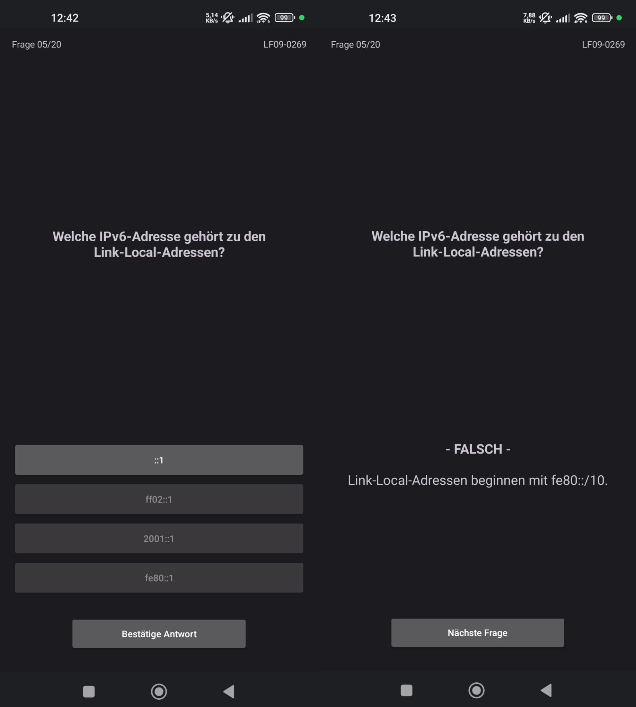

# projectFIQA (Android)

An Android quiz application built with Java, designed for learning and preparing for the IHK final exam (AP1).

For a runnable example (.apk), see the **v1.0-beta release** in the Releases section.

---

## Screenshot

Preview of the quiz interaction:

*Example quiz interaction including answer selection and evaluation (v1.0-beta)*

---

## Status
Current version: v1.0-dev

Last stable release: v1.0-beta

Designed for Android (.apk).

---

## Project Overview

This application is the mobile counterpart of the projectFIQA desktop version.

Motivation:
- Learning during commuting should be possible in a more practical way
- Replace inefficient “dead time” (e.g. reading books on the train)

Solution:
- Mobile quiz app for Android devices
- Designed for quick learning sessions anywhere
- Similar logic and structure as the desktop version

Note:
- UI and implementation differ due to platform constraints
- Core logic and flow are kept as similar as possible for easier maintenance

---

## Current Status

- Working “20 Questions Mode”
- Randomized selection of 20 questions per learning field
- Question format: True/False or 1 out of 4
- Includes an answer confirmation step to prevent accidental selections and improve usability.
- The Android version supports both light and dark mode.
- The action buttons follow a custom style matching the answer buttons and adapt to both light and dark mode.

---

## Goals

- Implement AP1 exam simulation mode
- Improve UI based on user feedback
- Expand question database with high-quality exam-oriented content

---

## Learning Objectives

- Learn Android development environment
- Understand mobile UI design
- Maintain cross-platform project structure
- Apply Java knowledge in real-world scenario

---

## Changelog

### v1.0-dev (desktop & android)

Priority (based on user feedback):
- Immediate feedback on answer buttons (green/red)
- Remove extra result screen after answering
- Optional review of incorrectly answered questions after a round

Design decisions:
- Kept answer confirmation button to prevent accidental selections (based on user feedback)

General:
- Refactor desktop version to match Android structure
- Separate main menu from quiz flow for better parity
- Implement AP1 mode with JSON-based question logic
- Add at least 30 high-quality exam-oriented questions per subtopic (LF1–LF6)
- Add repetition mode for individual learning fields
- Track correctly answered questions using IDs and timestamps
- Reintroduce questions into the pool after 2–3 days (learning curve)
- Consider adding statistics / correctness percentage display

---

### v1.0-beta (desktop & android)

- Implemented GUI versions for Desktop (JavaFX) and Android
- Android version already separates menu and quiz flow
- Created Windows desktop build (.exe)
- Created Android debug build (.apk)

User testing:
- Tested with classmates (learning field 9 questions)
- Overall positive feedback
- UI improvements requested
